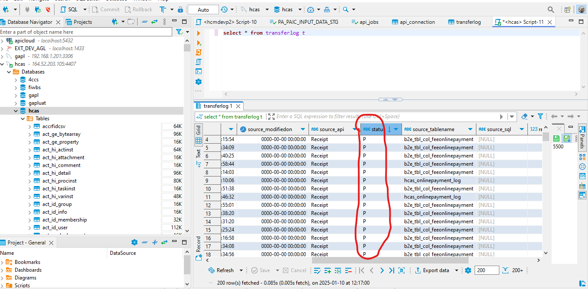
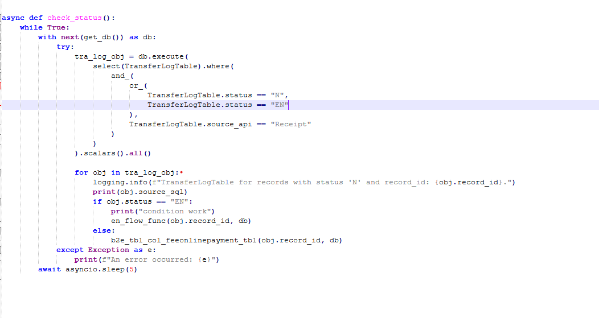

# PYTHON-VAS-APPLICATION

This project involves a VAS (Value-Added Services) application that monitors and processes data from multiple tables. The process begins by inserting a new record in the transfer_log table with a status of "N" (New) and a timestamp. As business logic is executed across four or five tables, the status is updated to "P" (Post) once the processing is complete. If any errors occur during the process, the status is changed to "E" (Error) to indicate a failure. The application automatically watches the transfer_log table and progresses accordingly, ensuring seamless data handling and status updates throughout the workflow.

